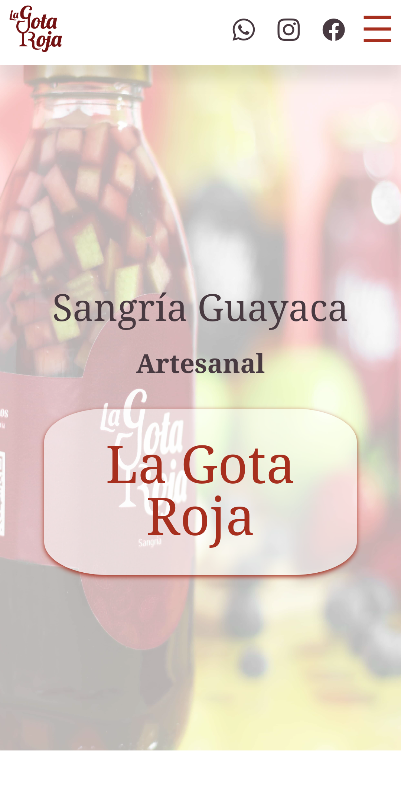

# Sangría La Gota Roja

Sitio web creado en **HTML5** y estilos gestionados con **SCSS**, diseñado para promover y presentar las sangrías embotelladas de "La Gota Roja".

## Características

- **Responsive Design:** Adaptado para dispositivos móviles, tabletas y escritorios.
- **Metadatos y SEO:** Incluye metadatos optimizados, como descripciones y etiquetas Open Graph para redes sociales.
- **Animaciones:** Uso de la librería [AOS](https://michalsnik.github.io/aos/) para animaciones atractivas.
- **Schema Markup:** Implementación de JSON-LD para mejorar la visibilidad en motores de búsqueda.
- **Elementos visuales:** Integración de imágenes 

## Tecnologías Utilizadas

- **HTML5:** Estructura semántica y escalable.
- **SCSS:** Preprocesador CSS para una gestión más eficiente de los estilos.
- **JavaScript:** Scripts personalizados y biblioteca AOS para animaciones.
- **Bootstrap Icons:** Para iconografía.

## Estructura del Proyecto

```
┌── assets
│   ├── icons
│   ├── images
│   └── styles
├── css
├── scss
├── js
└── index.html
```

- **assets:** Contiene los recursos multimedia como imágenes, íconos y hojas de estilo.
- **css:** Estilos generados a partir de SCSS.
- **scss:** Preprocesador de estilos SCSS
- **js:** Archivos JavaScript para funcionalidades interactivas.
- **index.html:** Archivo principal del proyecto.

## Dependencias

- [AOS](https://michalsnik.github.io/aos/): Animaciones.
- [Bootstrap Icons](https://icons.getbootstrap.com/): Iconos.

### Presentación Principal


## Autoría

Este código es propiedad de **Carlos Javier**. Todos los derechos reservados. No está permitido copiar, modificar o distribuir este código sin autorización expresa del autor.

## Licencia

El contenido de este repositorio está protegido. El uso o reproducción del mismo está estrictamente prohibido sin el consentimiento del autor.
